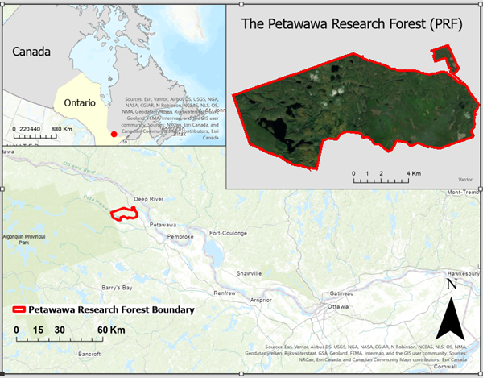
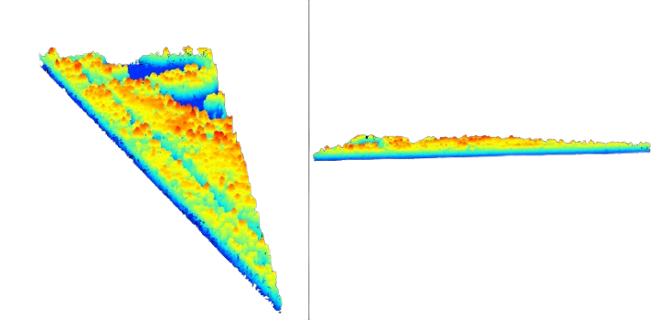
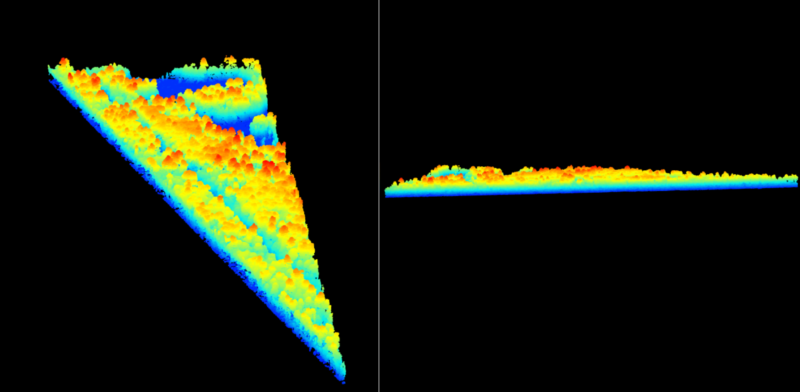
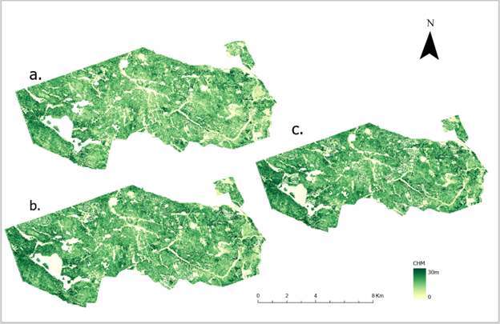
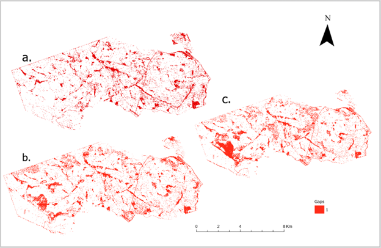
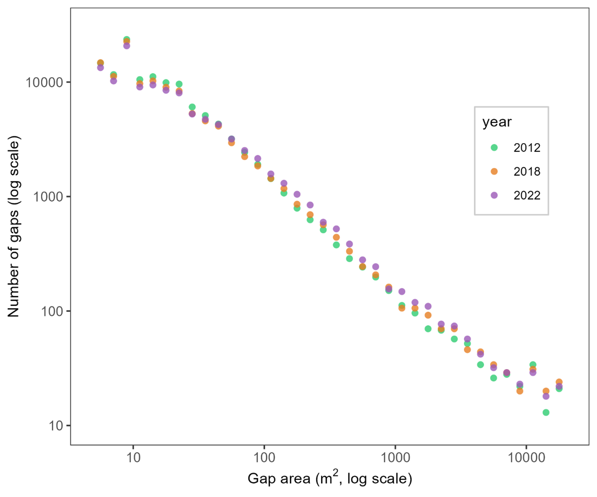
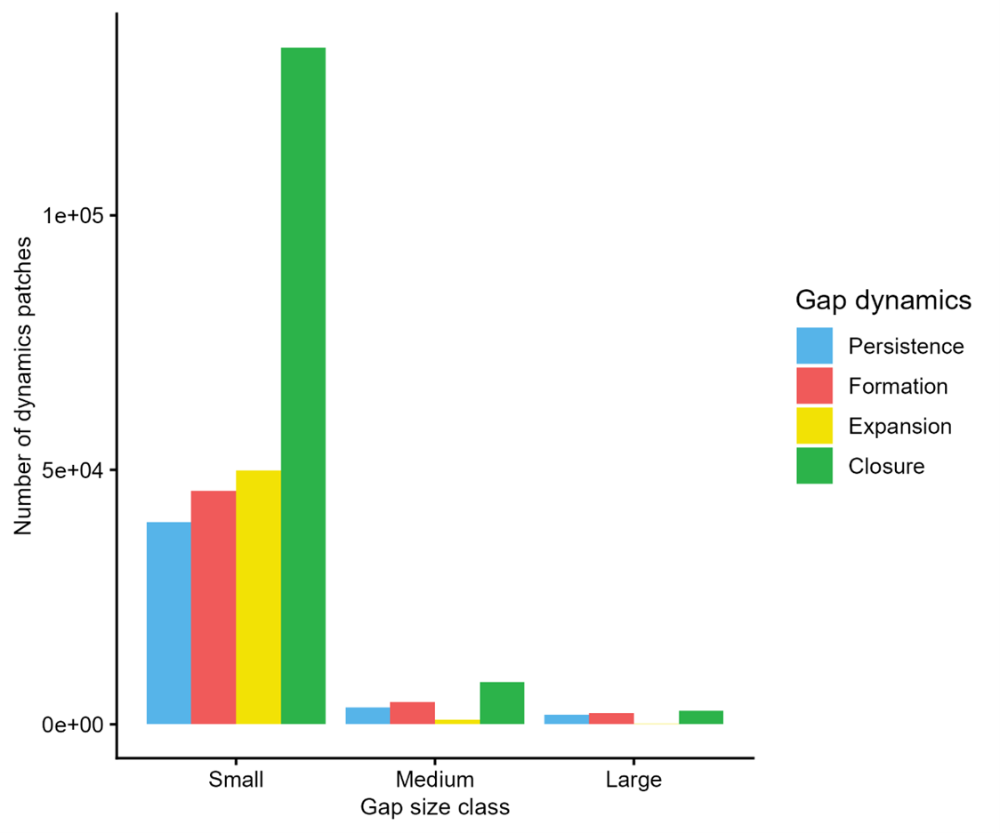
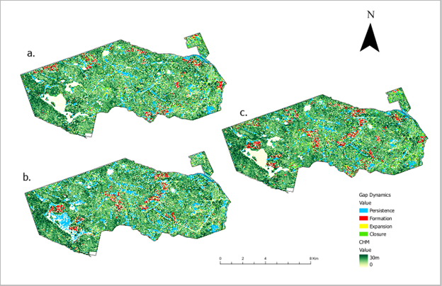

# Mapping Canopy Gap Dynamics in the Petawawa Research Forest

**Janice Owusu** · MSc Candidate, Geomatics for Environmental Management · University of British Columbia  
**Supervisor:** Dr. Joanne C. White · Research Scientist, Canadian Forest Service  
**Completed:** December 2025 – Feb 2026

---

## Overview

Canopy gaps - openings in the forest canopy created by the death or removal of trees - are fundamental to forest succession, species diversity, and ecosystem resilience. Yet tracking how they form, grow, persist, and close over time remains difficult at landscape scale using traditional field methods.

This project uses **multi-temporal airborne laser scanning (ALS)** data from 2012, 2018, and 2022 to map and quantify canopy gap dynamics across the **Petawawa Research Forest (PRF)** in Ontario, Canada - a 10,000-hectare experimental forest at the junction of the boreal and temperate zones. By applying consistent thresholds and a reproducible R-based workflow across all three time points, the project produces the first spatially explicit, decadal record of gap turnover at PRF.

---

## Study Area

*Figure 1: Location of the Petawawa Research Forest (PRF) in Ontario, Canada.*

The Petawawa Research Forest sits on the southern edge of the Canadian Shield within the Great Lakes–St. Lawrence forest region. Its mixed composition of white pine, red pine, trembling aspen, red oak, white birch, and maple - combined with over a century of experimental management, windthrow, and insect disturbance - makes it an ideal landscape for studying structural dynamics.

<!--  -->

*Figure 2:  A single airborne LiDAR tile over the Petawawa Research Forest shown from two angles - top-down (left) and side profile (right). Points are coloured by height; red/yellow indicates tall canopy, blue/green indicates lower vegetation and ground returns.*

Three ALS datasets were sourced from the **PRF Remote Sensing Supersite** (Canadian Forest Service / NFIS open-data portal):

| Year | Area (km²) | Point Density (pts m⁻²) | CRS |
|------|------------|--------------------------|-----|
| 2012 | 130.9 | ~12 | NAD83(CSRS) / UTM 18N |
| 2018 | 107.1 | ~35 | NAD83(CSRS) / UTM 18N + CGVD28 |
| 2022 | 107.1 | ~40 | NAD83(CSRS) / UTM 18N + CGVD28 |

---

## Research Question

> To what extent can multi-temporal ALS data from 2012, 2018, and 2022 detect and quantify canopy gap dynamics - including gap formation, expansion, persistence, and closure - in the Petawawa Research Forest, using a fixed 3 m canopy-height threshold and gap-size limits of 5 m² to 2 ha?

---

## Methods

### 1. Data Preprocessing & CHM Generation
Raw LiDAR point clouds were normalized and processed in **R** using the `lidR` package (Roussel et al., 2020) to generate 1 m canopy height models (CHMs) for each year. Raster clipping and spatial alignment were performed in **ArcGIS Pro**, with all CHMs clipped to the PRF boundary to ensure a consistent spatial extent.

### 2. Canopy Gap Detection
Gaps were identified independently for each year by applying a fixed height threshold of **< 3 m**, following established canopy-gap methods (White et al., 2018). Contiguous sub-canopy pixels were grouped into gap polygons, and polygons smaller than **5 m²** or larger than **20,000 m²** were removed to exclude noise and non-forest openings. This produced three annual gap layers.

### 3. Multi-Temporal Change Classification
The 2012, 2018, and 2022 gap layers were overlaid to classify each gap pixel into one of four dynamics categories, following the framework of Vepakomma et al. (2012):

- **Formation** - new gap where none previously existed
- **Expansion** - growth at the edges of a pre-existing gap
- **Persistence** - gap remaining open across consecutive time steps
- **Closure** - gap returning to closed canopy

Classifications were produced for three intervals: 2012–2018, 2018–2022, and 2012–2022.

### 4. Gap Size Distribution Analysis
Gap areas were plotted on log–log axes in R to visualize the heavy-tailed structure of size distributions (Goodbody et al., 2020). Gaps were also stratified by size class - **small** (5–50 m²), **medium** (51–200 m²), and **large** (> 200 m²) - to examine how different gap sizes contribute to both area-based and count-based dynamics.

### 5. Visualization
All gap and change maps were produced in ArcGIS Pro. Statistical figures (histograms, log–log plots, bar charts) were produced in R and Excel.

---

## Key Results

### Canopy Height Structure
1 m CHMs for all three years show a landscape dominated by continuous, closed canopy with spatially coherent areas of reduced height. Differences among years are subtle but ecologically meaningful, with areas of height gain and loss visible across acquisitions.

*Figure 3: Normalized 1 m Canopy Height Models for (a) 2012, (b) 2018, and (c) 2022 in the Petawawa Research Forest.*

### Gap Extent & Distribution
Canopy gaps are widespread across PRF, occurring predominantly as small, spatially dispersed openings embedded within intact forest. Some openings persist in the same location across all three years, while others appear or close between acquisitions.

*Figure 4: Canopy gap maps (<3 m threshold) for (a) 2012, (b) 2018, and (c) 2022 in the Petawawa Research Forest, showing spatial continuity and change through time.*

### Gap Size Distributions
Gap-size distributions are strongly **right-skewed** - small gaps dominate numerically at every time point, with frequency declining rapidly as gap size increases. On log–log axes, intermediate and large gap sizes follow a near-linear power-law trend consistent across 2012, 2018, and 2022, indicating a scale-invariant gap structure characteristic of disturbance-driven canopy turnover.

*Figure 5: Gap size frequency plotted on log–log axes for 2012, 2018, and 2022, illustrating heavy-tailed behavior and a systematic decline in gap frequency with increasing gap area (m²).*

### Gap Dynamics (2012–2022)
Over the full decade:
- **Persistence** accounts for the largest total gap area - reflecting large, long-lived openings such as wetlands, roads, and silvicultural clearings.
- **Closure** and **formation** both contribute substantial area, driven by many smaller gaps cycling through canopy turnover.
- **Expansion** represents the smallest share, occurring as localized features along gap edges.

By **count**, small gaps dominate every dynamics class. By **area**, large gaps disproportionately drive persistence and closure - a pattern consistent with previous ALS-based studies in Canadian mixedwood forests.

*Figure 6: Number of dynamics patches summarized by gap size class (small, medium, large) and dynamics class (closure, expansion, formation, persistence) for the 2012–2022 interval.*

### Spatial Patterns
Persistence forms the largest, most contiguous patches across the landscape. Formation and closure are more fragmented and dispersed. The spatial arrangement of dynamics shifts between intervals (2012–2018 vs. 2018–2022), indicating that canopy turnover is ongoing and spatially variable rather than concentrated in fixed locations.

*Figure 7: Multi-temporal canopy gap-dynamics maps for (a) 2012–2018, (b) 2018–2022, and (c) 2012–2022, highlighting spatial patterns of formation, expansion, persistence, and closure.*

---

## Tools & Technologies

| Category | Tools |
|----------|-------|
| LiDAR Processing | R (`lidR`, `terra`) |
| Spatial Analysis & Mapping | ArcGIS Pro |
| Statistical Analysis & Visualization | R (`ggplot2`), Microsoft Excel |
| Data Source | PRF Remote Sensing Supersite (Canadian Forest Service / NFIS) |

---

## References

Goodbody, T. R., Tompalski, P., Coops, N. C., White, J. C., Wulder, M. A., & Sanelli, M. (2020). Uncovering spatial and ecological variability in gap size frequency distributions in the Canadian boreal forest. *Scientific Reports*, 10(1), 6069.

Roussel, J.-R., Auty, D., Coops, N. C., Tompalski, P., Goodbody, T. R. H., Meador, A. S., Bourdon, J.-F., De Boissieu, F., & Achim, A. (2020). lidR: An R package for analysis of Airborne Laser Scanning (ALS) data. *Remote Sensing of Environment*, 251, 112061.

Vepakomma, U., Kneeshaw, D., & Fortin, M.-J. (2012). Spatial contiguity and continuity of canopy gaps in mixed wood boreal forests: Persistence, expansion, shrinkage and displacement. *Journal of Ecology*, 100(5), 1257–1268.

White, J. C., Tompalski, P., Coops, N. C., & Wulder, M. A. (2018). Comparison of airborne laser scanning and digital stereo imagery for characterizing forest canopy gaps in coastal temperate rainforests. *Remote Sensing of Environment*, 208, 1–14.

White, J. C., Chen, H., Woods, M. E., Low, B., & Nasonova, S. (2019). The Petawawa Research Forest: Establishment of a remote sensing supersite. *The Forestry Chronicle*, 95(03), 149–156.

---

*Capstone project submitted in partial fulfillment of the Master of Geomatics for Environmental Management (MGEM), University of British Columbia.*
