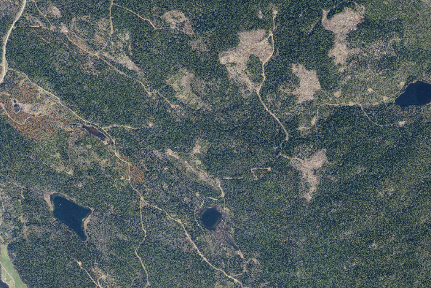
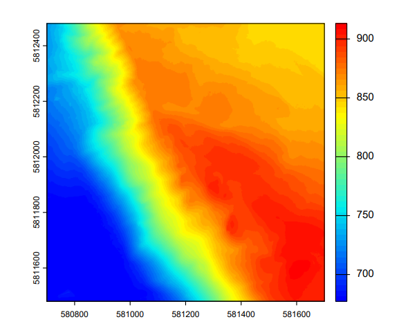
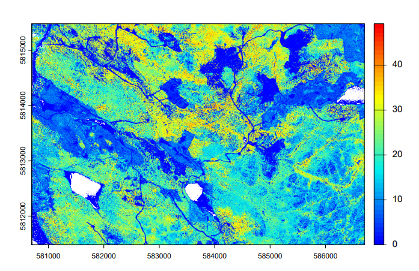
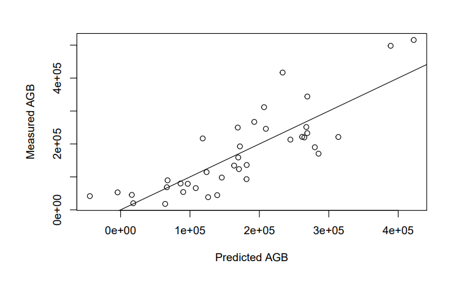
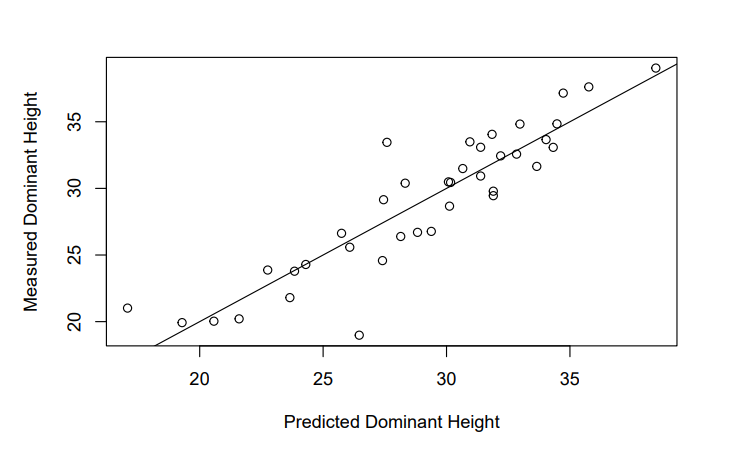
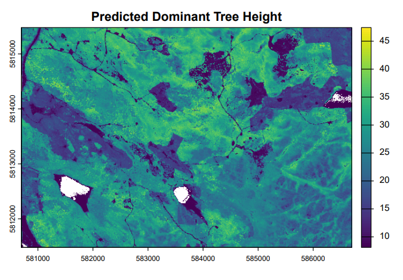

# LiDAR-Derived Forest Attribute Mapping – Alex Fraser Research Forest

**Janice Owusu** · GEM 521 – LiDAR Remote Sensing · University of British Columbia  
**Tools:** R · lidR · terra · tidyverse

---

## Overview

Airborne LiDAR (Light Detection and Ranging) provides a dense, three-dimensional record of forest structure that can be used to model key ecological attributes across entire landscapes - far beyond what field plots alone can capture. This project develops a complete wall-to-wall LiDAR analysis pipeline for the **Alex Fraser Research Forest (AFRF)** in British Columbia, producing spatially continuous maps of **aboveground biomass (AGB)** and **dominant tree height** at 10 m resolution.

The workflow moves from raw point cloud ingestion through normalization, canopy height model (CHM) generation, plot-level metric extraction, stepwise regression modeling, and wall-to-wall spatial prediction - demonstrating how LiDAR data can bridge field measurements and landscape-scale forest inventory.

---

## Study Area

The **Alex Fraser Research Forest** is a 10,000-hectare research and teaching forest managed by the University of British Columbia, located near Williams Lake in the central interior of British Columbia. The forest spans a range of elevation, slope, and stand conditions characteristic of the Interior Douglas-fir and Sub-Boreal Spruce biogeoclimatic zones.

*Figure 1: RGB aerial photograph of the Alex Fraser Research Forest, showing the mosaic of forest cover, cutblocks, lakes, and road networks across the study area.*

---

## Data

| Input | Description |
|-------|-------------|
| `AFRF_Aerial_Photo.tif` | RGB aerial photograph of the study area |
| `L3_Data/LAS/` | Raw airborne LiDAR tiles (LAScatalog) |
| `L3_Data/Normalized LAS/` | Height-normalized LiDAR tiles |
| `Plot_Table.csv` | Field plot centers with measured AGB and dominant height |
| `afrf_Plot_Metrics.csv` | LiDAR-derived point cloud metrics per plot |

---

## Methods

### 1. Data Loading & Inspection
LiDAR data were loaded as a `LAScatalog` using the `lidR` package. Individual tiles were checked for data integrity (`las_check()`), and maximum point heights were inspected to confirm data quality.

### 2. Digital Elevation Model (DEM) Generation
A 2 m resolution DEM was generated from the raw point cloud using a triangulated irregular network (TIN) interpolation (`rasterize_terrain()` with `tin()`). This surface model forms the reference for height normalization.

*Figure 2: 2 m resolution Digital Elevation Model (DEM) of the Alex Fraser Research Forest, generated using TIN interpolation. Elevation ranges from ~700 m to ~900 m.*

### 3. Point Cloud Normalization
LiDAR heights were normalized relative to the DEM, converting absolute elevations to heights above ground. Normalized tiles were filtered to remove points below 0 m and above 55 m to eliminate noise.

### 4. Canopy Height Model (CHM) Generation
A 2 m resolution CHM was generated from the normalized catalog using a point-to-raster approach (`rasterize_canopy()` with `p2r()`), providing a spatially continuous surface of canopy height across the full study area.

*Figure 3: 2 m resolution Canopy Height Model (CHM) of the Alex Fraser Research Forest. Values range from 0 to ~40 m.*
*

### 5. Plot-Level Metric Extraction
Field plot locations (radius = 10 m) were clipped from the normalized catalog. For each plot, standard LiDAR point cloud metrics (`.stdmetrics`) were computed - including height percentiles, maximum height (`zmax`), and standard deviation of heights (`zsd`) - producing a per-plot metrics table for model calibration.

### 6. Stepwise Regression Modeling
Forward stepwise regression (via `add1()` with F-test, α = 0.05) was used to identify the best LiDAR predictors for two forest attributes:

- **Aboveground Biomass (AGB)** - response variable from field plots
- **Dominant Height** - response variable from field plots

Candidate predictors included all height-based metrics beginning with `z` or `pz` from the `.stdmetrics` suite.

### 7. Wall-to-Wall Prediction
Pixel-level LiDAR metrics were computed at **10 m resolution** across the full AFRF extent. Final regression models were applied to the pixel metric stack using `predict()`, generating spatially continuous raster maps of AGB and dominant height.

---

## Results

### Aboveground Biomass (AGB) Model

| Item | Value |
|------|-------|
| **Selected predictors** | `zmax`, `zsd` |
| **Final equation** | AGB = −217,292 + 20,255 × zmax − 34,105 × zsd |
| **Multiple R²** | 0.6915 |
| **Adjusted R²** | 0.6739 |

The model explains approximately **69% of variance** in field-measured AGB. `zmax` captures the upper canopy height signal associated with larger, biomass-dense trees, while `zsd` accounts for vertical structural heterogeneity - taller but more variable canopies tend to have lower biomass density, reflected in the negative coefficient.

*Figure 4: Predicted versus measured AGB at field plot locations, with a 1:1 reference line (R² = 0.69).*

### Dominant Height Model

| Item | Value |
|------|-------|
| **Selected predictor** | `zmax` |
| **Final equation** | Dominant Height = 8.117 + 0.724 × zmax |
| **Multiple R²** | 0.8208 |
| **Adjusted R²** | 0.8158 |

The dominant height model explains **82% of variance** using `zmax` alone - a strong result consistent with the well-established relationship between maximum LiDAR return height and stand dominant height in coniferous forests.

*Figure 5: Predicted versus measured dominant height at field plot locations, with a 1:1 reference line (R² = 0.82).*

### Wall-to-Wall Maps
Both models were applied across the full AFRF at 10 m resolution, producing spatially continuous maps of predicted AGB and dominant height. These maps reveal landscape-scale variation in forest structure linked to topography, stand age, and disturbance history.

*Figure 3: 2 m resolution Digital Elevation Model (DEM) of the Alex Fraser Research Forest, generated using TIN interpolation. Elevation ranges from ~700 m to ~900 m.*

*Figure 3: Wall-to-wall predicted dominant tree height at 10 m resolution across the Alex Fraser Research Forest.*

---

## Tools & Technologies

| Category | Tools |
|----------|-------|
| Point Cloud Processing | R (`lidR`) |
| Raster Analysis | R (`terra`) |
| Statistical Modeling | R base (`lm`, `add1`, stepwise regression) |
| Data Wrangling | R (`tidyverse`, `dplyr`) |
| Data Source | UBC Alex Fraser Research Forest LiDAR dataset |

---

## Key Takeaways

- A **forward stepwise regression** approach efficiently identifies parsimonious LiDAR-to-attribute models without overfitting
- `zmax` is a robust predictor for both biomass and dominant height in this forest type - confirming its utility as a structural indicator
- The **AGB model (R² = 0.69)** and **height model (R² = 0.82)** both demonstrate operationally useful predictive power for wall-to-wall forest inventory
- The full pipeline - from raw point cloud to wall-to-wall prediction - is reproducible and scalable to other ALS datasets

---

*Lab project completed as part of GEM 521 – LiDAR Remote Sensing, University of British Columbia.*
