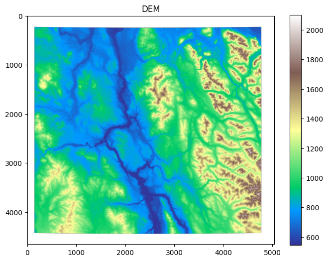
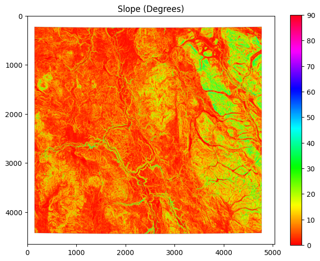
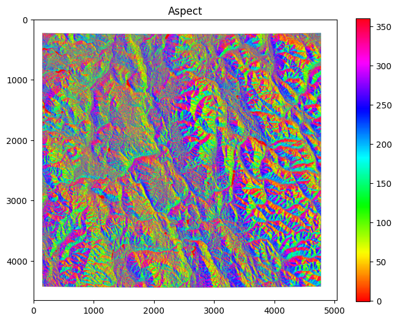
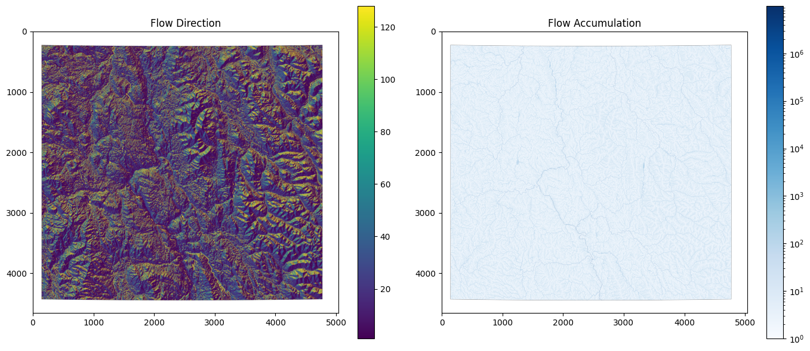
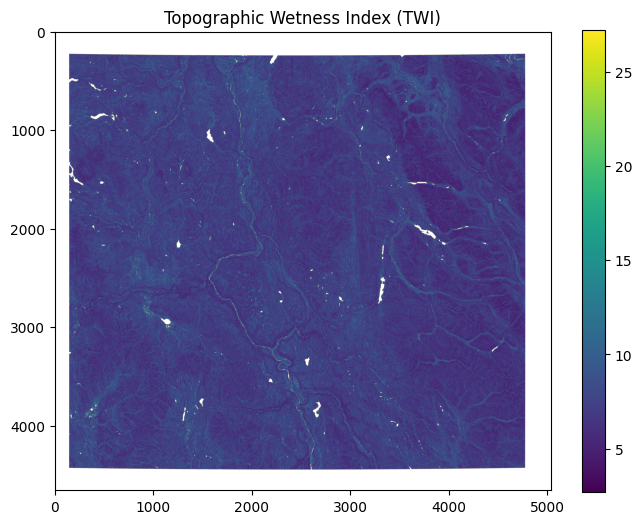
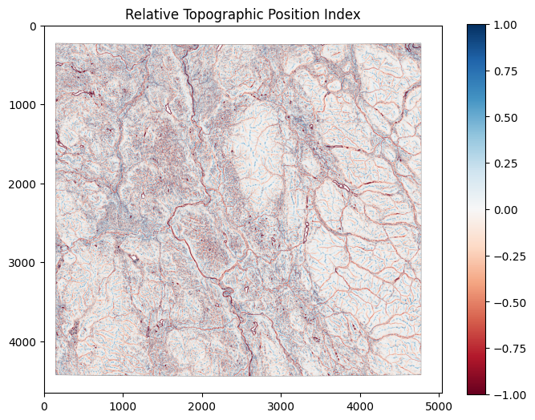
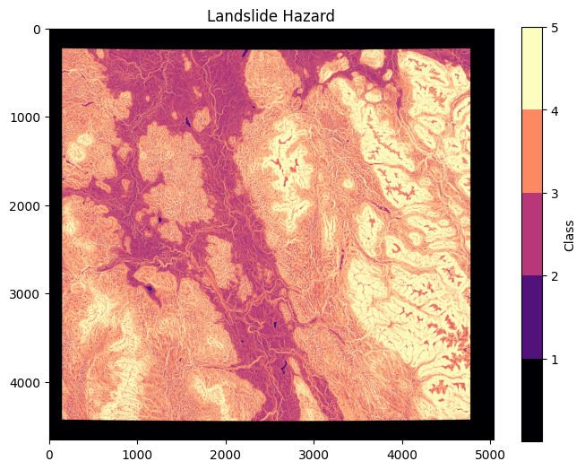

# Topographic and Terrain-Based Hazard Screening of Harvested Cutblocks in Central British Columbia

**Authors:** Owusu, Mawlod, Thomas, Arade · GEM 530 · University of British Columbia  
**Tools:** Python · WhiteboxTools · Rasterio · GeoPandas · QGIS

---

## Overview

Forest harvesting on British Columbia's steep and varied terrain can alter surface hydrology, reduce root reinforcement, and increase susceptibility to shallow landslides and flooding. Yet these risks are not uniform - terrain conditions vary substantially across the landscape, and not all harvested areas carry the same hazard potential.

This project empirically characterizes the topographic conditions of harvested cutblocks in a study area in central BC, compares them to the surrounding landscape, and evaluates whether harvesting aligns with lower-risk terrain. A terrain-based hazard index was constructed from slope, topographic wetness, relative topographic position, and elevation - providing a spatially explicit screening tool to assess geohazard susceptibility across harvested and unharvested land.

---

## Study Area & Data

The analysis covers a study area in central British Columbia. Cutblock boundaries, an area of interest (AOI) polygon, and a **30 m DEM (EPSG:3005)** were used as primary inputs.

| Input | Description |
|-------|-------------|
| `dem.tif` | 30 m Digital Elevation Model, BC Albers projection |
| `cutblocks.gpkg` | Harvested cutblock polygons |
| `aoi.gpkg` | Area of interest boundary |

---

## Methods

### 1. DEM Preprocessing
The DEM was clipped to the AOI and sink-filled using WhiteboxTools to ensure hydrological continuity - a prerequisite for accurate flow direction and accumulation modeling.

*Figure 1: 30 m Digital Elevation Model (DEM) of the AOI after sink-filling. Elevation variation across the landscape provides the foundation for all terrain derivative calculations.*

### 2. Terrain Derivatives
Six terrain layers were derived from the filled DEM:

| Layer | Description |
|-------|-------------|
| **Slope** | Terrain steepness in degrees - primary driver of slope instability |
| **Aspect** | Dominant slope orientation |
| **Flow Direction** | D8 pointer indicating downslope direction |
| **Flow Accumulation** | Number of upslope cells draining to each cell |
| **TWI** | Topographic Wetness Index - quantifies soil saturation potential (ln(SCA / tan(slope))) |
| **RTPI** | Relative Topographic Position Index - identifies ridges, midslopes, and valley bottoms |

### 3. Reclassification
Each continuous raster was reclassified into a 1–5 ordinal hazard scale to enable weighted combination:

| Layer | Reclassification Basis |
|-------|------------------------|
| Slope | BC slope classification (0–2°=1, 2–5°=2, 5–15°=3, 15–30°=4, >30°=5) |
| Elevation | Inverted elevation bands (highest elevations = lower hazard) |
| TWI | Increasing wetness = increasing hazard (class 1–5) |
| RTPI | Valley positions = highest hazard; ridges = lowest |

### 4. Weighted Hazard Index
A composite hazard index was computed using a weighted sum:

| Layer | Weight | Rationale |
|-------|--------|-----------|
| Slope | 40% | Dominant control on slope stability |
| TWI | 30% | Moisture-related instability |
| RTPI | 20% | Valley confinement and drainage context |
| Elevation | 10% | Contextual terrain variation |

The final index was classified into five hazard classes (1 = lowest, 5 = highest).

### 5. Cutblock Overlay & Zonal Statistics
Cutblocks were overlaid on the hazard index to quantify the distribution of hazard classes within harvested areas. Zonal statistics were computed and exported for spatial comparison against the full AOI.

---

## Results

**Slope:** The AOI is dominated by gentle to moderate slopes. Cutblocks are concentrated in the 10°–25° range, while the AOI includes a broader proportion of flatter terrain - consistent with harvesting avoiding the steepest ground.

*Figure 2: Slope map (degrees) across the AOI. Cutblocks are predominantly located on gentle to moderate slopes, avoiding the steepest terrain.*

**Aspect:** The landscape contains a mix of south-, west-, and east-facing slopes, with harvested areas reflecting this broader distribution.

*Figure 3: Aspect map showing dominant slope orientation across the AOI. The landscape contains a mix of south-, west-, and east-facing slopes.*

**Flow Accumulation & Stream Networks:** High accumulation values trace concentrated drainage paths and potential stream initiation zones. Cutblocks largely avoid these corridors.

*Figure 4: Flow direction and accumulation across the AOI. High accumulation values trace concentrated drainage paths and potential stream initiation zones.*

**TWI:** Valley bottoms and convergent terrain show the highest wetness values. Cutblocks skew toward mid and upper-slope positions with lower TWI.

*Figure 5: Topographic Wetness Index (TWI) across the AOI. Valley bottoms and convergent terrain show the highest soil moisture potential.*

**RTPI:** Harvested areas avoid valley-confined positions with the highest RTPI-based hazard scores.

*Figure 6: Relative Topographic Position Index (RTPI) across the AOI. Lower values indicate valley bottoms; higher values indicate ridgelines.*

**Hazard Index:** When overlaid on the composite hazard map, most cutblocks fall within low-to-moderate hazard classes (1–3), with minimal overlap in the highest-risk zones. This suggests that harvesting in this AOI preferentially targets midslope and upper-slope positions that are relatively stable and well-drained.

*Figure 7: Composite terrain hazard index (classes 1–5) with cutblock overlay. Most harvested areas fall within low-to-moderate hazard classes.*

**Overall conclusion:** Harvesting in this study area reflects deliberate placement within more stable terrain, consistent with practices that minimize geohazard exposure.

---

## Limitations

- **30 m DEM resolution** may underrepresent narrow hollows, small headwater channels, and localized slope breaks, potentially underestimating wetness or slope extremes.
- **Hazard weights** were assigned based on domain knowledge rather than calibration against observed landslide inventories - the index should be interpreted as a relative screening tool, not a predictive model.
- **Zonal statistics** could not be fully automated in Python due to WhiteboxTools export constraints; additional processing was completed in QGIS.
- **Topographic factors only** - soil type, rooting depth, forest age, and precipitation intensity were not included, despite their influence on landslide and flood processes.

---

## Future Directions

- Integration of soil, lithology, and precipitation datasets for stronger hazard prediction
- Machine learning approaches (e.g., logistic regression) for susceptibility mapping incorporating dynamic factors
- Validation against historical landslide inventories and field surveys
- Province-wide flood susceptibility modeling to support broader forest planning
- Real-time dashboard integrating rainfall, soil saturation, and streamflow data for operational risk management

---

## Tools & Technologies

| Category | Tools |
|----------|-------|
| Terrain Analysis | Python (`WhiteboxTools`, `rasterio`, `numpy`) |
| Spatial Data Handling | Python (`geopandas`) |
| Visualization | Python (`matplotlib`) |
| Additional Processing | QGIS |
| Data Source | BC Government Open Data - 30 m DEM, EPSG:3005 |

---

## References

Beven, K. J., & Kirkby, M. J. (1979). A physically based, variable contributing area model of basin hydrology. *Hydrological Sciences Bulletin*, 24(1), 43–69.

Guthrie, R. H., Friele, P. A., & Allstadt, K. E. (2010). Landslides and forest management in the Pacific Northwest. *Natural Hazards*, 52(2), 319–340.

Sidle, R. C. (1992). A conceptual model of changes in root cohesion in response to vegetation management. *Journal of Environmental Quality*, 21(1), 1–5.

---

*Course project completed as part of GEM 530 - Remote Sensing for Environmental Applications, University of British Columbia.*
